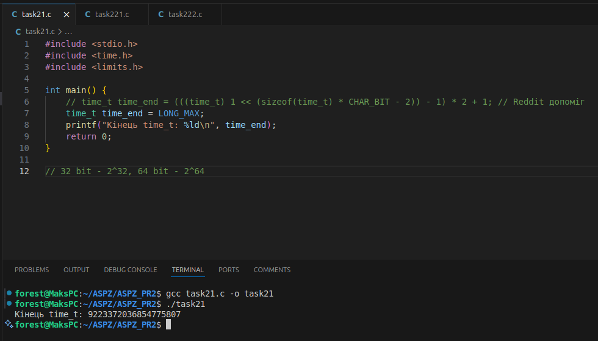

Цей проєкт містить реалізацію та дослідження, пов’язані з пам’яттю, стеком, сегментами файлу та власним менеджером пам’яті.

Визначення, коли `time_t` закінчиться.
Коли закінчиться `time_t` залежить архітектура системи, якщо в нас 32 біти, то вона закінчиться на числі 32^32, якщо 64 то на 64^64.
Ці числа також можна перевести у формат часу.

Оскільки в мене 64х система, то маємо:

Далі ми досліджуємо сегменти виконуваного файлу за допомогою `ls -l` та `size`.

`ls -l` - відображає інформацію про файл (права, власник, розмір, час зміни)

`size` - показує сегменти:
1. text – розмір коду програми
2. data – ініціалізовані змінні
3. bss – неініціалізовані змінні
4. dec\hex – загальний розмір цих сегментів

Зміну розміру та сегментів можна побачити за допомогою простого створення неініціалізованого масиву.
Таким чином розмір сегменту `BSS` та загальний розмір `dec\hex` збільшились.

Якщо ж ініціалізувати масив, сегмент `BSS` повертається в минуле значення й відповідно сегмент `data` збільшився, оскільки масив ініціалізований.

Якщо масив ініціалізовано, то він записується в `data` , якщо ні, то в `BSS`.
Якщо ж нестатичний масив, було створено у функції, то він буде записуватись в стек, при виклику цієї функції.

Також під час компіляції, можна задати такі елементи, як `-O2`,`-O0`,`-g`.
1. `-O2` - оптимізує, видаляє змінні, що не використовуються, кінцевий файл може бути більшим за початковий.
2. `-O0` - вимикає всю оптимізацію, код має початкову структуру, тому може використовуватись для налашодження, розмір початковий.
3. `-g` - Включає відлагоджувальну інформацію для `GDB`, розмір збільшився.

В наступному елементі коду, можна побачити, що при створенні змінної, змінюється вершина стеку.
На деяких системах стек зростає вниз, до пам’яті з меншими значеннями.

В наступному елементі коду, використовується відлашодження за допомогою `GDB`. 
Оскільки в мене `Ubuntu` й `Gstack` не працює.

Для цього було написано просту програму, що в середині виконання, буде ставати на паузу, щоб ми могли її дослідити.
Далі підключаємось до одного з процессів програми за допомогою команди `gdb -p $(pidof task)` й відповідно `bt` для дослідження стеку.

При виклику процедур і поверненні з них процесор використовує стек.
Для правильної його роботи використовується лічильник команд `IP`, зо передає інструкції процессору, куди повертатись.

В прикладі нижче було використано `IP` та стек. 

В даному випадку, оскільки ни зберігаємо поточний стан, то можна обійтись без автоматичного переходу або повернения `IP` (Інструкційного покажчика), але він всеодно використовується.
Повністю відмовившись від допомоги `IP` (Інструкційного покажчика) неможливо зробити коректне повернения з виклику, оскільки процесор не знатиме, куди передати керувания.

Для Перевірки цього, можна написати таку програму.

Як бачимо, програма зупинилась, оскільки ми використовеємо останній елемент стеку на пряму, що не може гарантувати коректну адресу повернення, тому використання `IP` (Інструкційного покажчика) є необхідним.

В наступному елементі коду, було написано власні функції `malloc` та `free`, але, оскільки прямого доступу до пам'яті системи в нас немає, ми будемо робити приближений варіант.
Тут ми створюємо розмір пам'яті, та її структуру, тоюто наступні елементи, поточні та статус.

Як бачимо, після виконання програми, на початку наш елемент мав статус `0`, що означає, що елемент `free=0`, тобто заповненний.
Після виконання команди `free`, ми звільнили пам'ять та змінили статус на `free=1`, тобт опам'ять тепер вільна.

**Завдання ЗАГАЛЬНЕ ДЛЯ ВСІХ**
**Завдання 2.1**
 1. Напишіть програму для визначення моменту, коли time_t
закінчиться.Дослідіть, які зміни відбуваються в залежності від 32- та
64-бітної архітектури. Дослідіть сегменти виконуваного файлу.
Завдання 2.2.
Розгляньте сегменти у виконуваному файлі.

**Завдання 2.2**
 1. Скомпілюйте програму hello world, запустіть ls -l для
виконуваного файлу, щоб отримати його загальний розмір, і
запустіть size, щоб отримати розміри сегментів всередині нього.

 2. Додайте оголошення глобального масиву із 1000 int,
перекомпілюйте й повторіть вимірювання. Зверніть увагу на
відмінності.

 3. Тепер додайте початкове значення в оголошення масиву
(пам’ятайте, що C не змушує вас вказувати значення для кожного
елемента масиву в ініціалізаторі). Це перемістить масив із сегмента
BSS у сегмент даних. Повторіть вимірювання. Зверніть увагу на
різницю.

 4. Тепер додайте оголошення великого масиву в локальну функцію.
Оголосіть другий великий локальний масив з ініціалізатором.
Повторіть вимірювання. Дані розташовуються всередині функцій,
залишаючись у виконуваному файлі? Яка різниця, якщо масив
ініціалізований чи ні?

 5. Які зміни відбуваються з розмірами файлів і сегментів, якщо ви
компілюєте для налагодження? Для максимальної оптимізації?
Проаналізуйте результати, щоб переконатися, що:
● сегмент даних зберігається у виконуваному файлі;
● сегмент BSS не зберігається у виконуваному файлі (за винятком
примітки щодо його вимог до розміру часу виконання);
● текстовий сегмент більшою мірою піддається перевіркам
оптимізації;
● на розмір файлу a.out впливає компіляція для налагодження, але не
сегменти.

**Завдання 2.3.**
Скомпілюйте й запустіть тестову програму, щоб визначити приблизне
розташування стека у вашій системі:

...

Знайдіть розташування сегментів даних і тексту, а також купи всередині
сегмента даних, оголосіть змінні, які будуть поміщені в ці сегменти, і
виведіть їхні адреси.
Збільшіть розмір стека, викликавши функцію й оголосивши кілька
великих локальних масивів. Яка зараз адреса вершини стека?

Примітка: стек може розташовуватися за різними адресами на різних
архітектурах та різних ОС. Хоча ми говоримо про вершину стека, на
більшості процесорів стек зростає вниз, до пам’яті з меншими значеннями
адрес.

**Завдання 2.4**
Ваше завдання – дослідити стек процесу або пригадати, як це робиться. Ви
можете:
● Автоматично за допомогою утиліти gstack.
● Вручну за допомогою налагоджувача GDB.
Користувачі Ubuntu можуть зіткнутися з проблемою: на момент написання
(Ubuntu 18.04) gstack, схоже, не був доступний (альтернативою може бути
pstack). Якщо gstack не працює, використовуйте другий метод – через
GDB, як показано нижче.
Спочатку подивіться на стек за допомогою gstack(1). Нижче наведений
приклад стека bash (аргументом команди є PID процесу):

...

Розбір стека:
● Номер кадру стека відображається ліворуч перед символом #.
● Кадр #0 – це найнижчий кадр. Читайте стек знизу вверх (тобто від
main() – кадр #6 – до waitpid() – кадр #0).
● Якщо процес багатопотоковий, gstack покаже стек кожного потоку
окремо.
Аналіз стека в режимі користувача через GDB

Щоб переглянути стек процесу вручну, використовуйте GDB,
приєднавшись до процесу.
Нижче наведена невелика тестова програма на C, що виконує кілька
вкладених викликів функцій. Граф викликів виглядає так:
main() --&gt; foo() --&gt; bar() --&gt; bar_is_now_closed() --&gt; pause()
Системний виклик pause() – це приклад блокуючого виклику. Він
переводить викликаючий процес у сплячий режим, очікуючи (або
блокуючи) сигнал. У цьому випадку процес блокується, поки не отримає
будь-який сигнал.

...

Тепер відкрийте GDB
У ньому підключіться (attach) до процесу (в наведеному прикладі PID =
24957) і дослідіть стек за допомогою команди backtrace (bt):

...

Примітка: В Ubuntu, через питання безпеки, GDB не дозволяє
підключатися до довільного процесу. Це можна обійти, запустивши GDB
від імені користувача root.

**В мене убунту, GSTACK не працює**

...

gstack — це, по суті, оболонковий скрипт (wrapper shell script), який
неінтерактивно викликає GDB і запускає команду backtrace, яку ви
щойно використали.
Завдання: Ознайомтеся з виводом gstack і порівняйте його з GDB.

**Завдання 2.5**
Відомо, що при виклику процедур і поверненні з них процесор
використовує стек.Чи можна в такій схемі обійтися без лічильника команд
(IP), використовуючи замість нього вершину стека? Обґрунтуйте свою
відповідь та наведіть приклади.

**Завдання для 3 варіанту:**
Реалізуйте власний менеджер пам’яті з аналогами malloc() та free().

**Всі завдання було виконано, та створено файли з кодом для кожного із завданнів. Також у папці Photos збережені скріншоти з результатами виконання кожного із завдань відповідно.**
